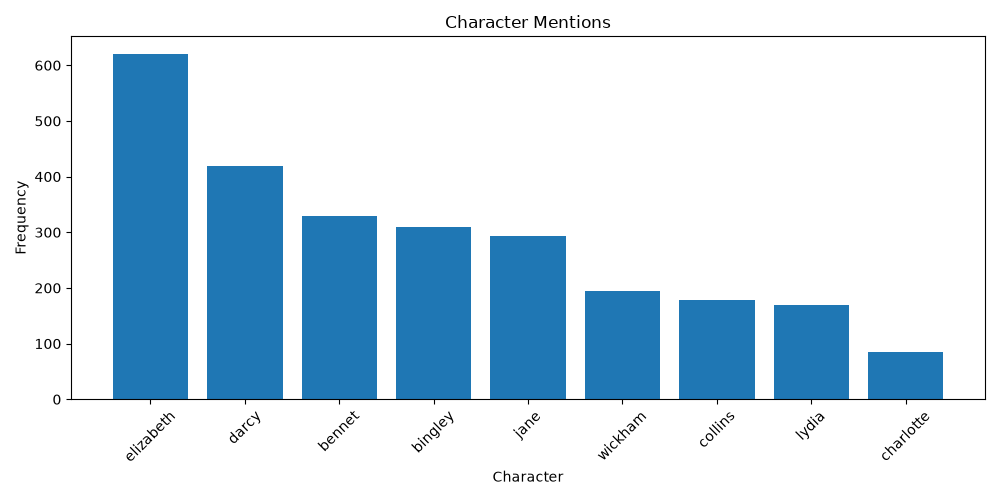
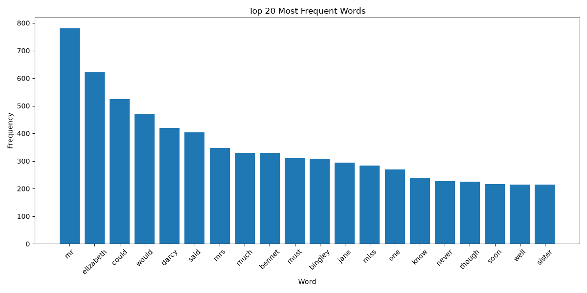
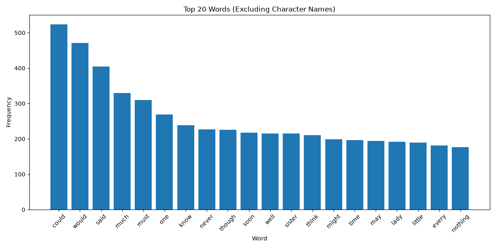
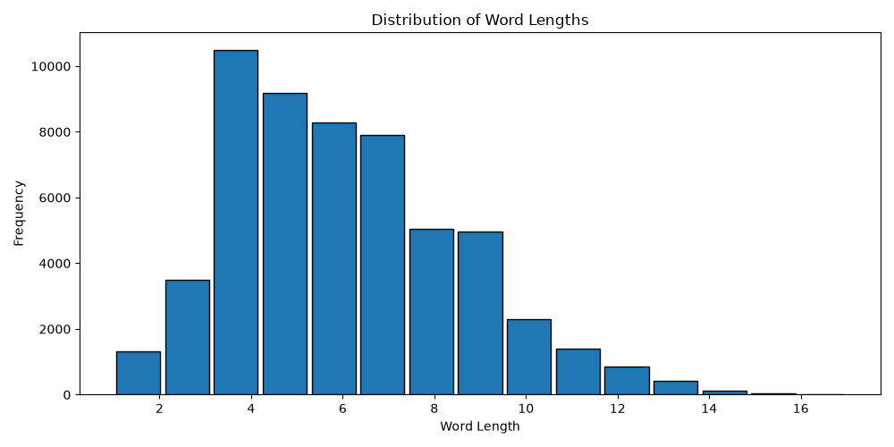

# End-to-End Text Analytics with Python

## Case Study: *Pride and Prejudice* by Jane Austen

This project demonstrates an end-to-end Natural Language Processing (NLP) workflow using Python. Starting from the HTML version of *Pride and Prejudice* obtained from Project Gutenberg, the novel is collected, cleaned, preprocessed, analysed, and visualised to uncover insights into its vocabulary, writing style, and character prominence.

---

## Project Objectives

- Download a novel from Project Gutenberg using web requests
- Parse HTML using BeautifulSoup
- Clean and preprocess textual data
- Perform Natural Language Processing (NLP)
- Explore vocabulary and writing style through exploratory data analysis
- Visualise key findings using Python

---

## Sample Visualizations

### Character Mentions

The frequency of mentions for the major characters throughout the novel.



---

### Top 20 Most Frequent Words

The most frequently occurring words after preprocessing.



---

### Top Words (Excluding Character Names)

Removing character names provides a clearer view of the novel's dominant vocabulary and recurring themes.



---

### Word Length Distribution

Distribution of word lengths after preprocessing.



---

## Dataset

**Source:** Project Gutenberg

**Book:** *Pride and Prejudice* by Jane Austen

**Format:** HTML

---

## Tools & Libraries

- Python
- Requests
- BeautifulSoup (bs4)
- NLTK
- Matplotlib

---

## Project Workflow

1. Download the HTML version of the novel using `requests`
2. Save the raw HTML locally
3. Parse the webpage using BeautifulSoup
4. Remove Project Gutenberg metadata
5. Remove front and back matter
6. Save the cleaned text
7. Preprocess the text
   - Convert to lowercase
   - Tokenize words
   - Remove punctuation
   - Remove stopwords
8. Perform exploratory data analysis
9. Create visualisations
10. Summarise key findings

---

## Key Findings

- The processed novel contains approximately **55,900 words** after preprocessing.
- Approximately **6,800 unique words** were identified.
- The lexical diversity is **0.122**, indicating a reasonably varied vocabulary despite repeated references to key characters.
- Elizabeth is the most frequently mentioned character, followed by Darcy.
- Dialogue-related words such as *could*, *would*, and *said* remain highly frequent after preprocessing.
- Character names and family-related terms highlight the novel's emphasis on interpersonal relationships and social interaction.

---

## Repository Structure

```text
end-to-end-text-analytics/

├── data/
│   ├── raw/
│   │   └── pride_and_prejudice.html
│   └── processed/
│       └── pride_and_prejudice_clean.txt
│
├── images/
│   ├── character_mentions.png
│   ├── top20_words.png
│   ├── top20_words_no_characters.png
│   └── word_length_distribution.png
│
├── notebooks/
│   └── end_to_end_text_analytics.ipynb
│
├── README.md
├── requirements.txt
└── .gitignore
```

---

## Future Improvements

Possible extensions to this project include:

- Compare multiple novels by Jane Austen
- Perform chapter-level analysis
- Apply sentiment analysis
- Explore topic modelling and named entity recognition
- Build an interactive Streamlit dashboard

---

## Author

Created by **Namya Nichani** as part of a personal Data Analytics portfolio.